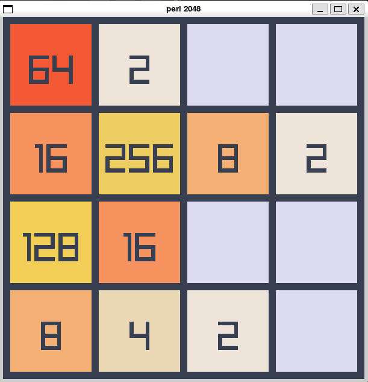

# perl 2048



simple 2048 game implementation using perl + raylib.

made for fun, to get more comfortable with perl and C interoperability.

## usage

```bash
./bin/main.pl
```

Gnu/Linux required. Adding Windows support should be trivial, but I can't be bothered.

## license

I ship shared raylib binary for convenience - it's licensed under original raylib license. See [RAYLIB-LICENSE](lib/RAYLIB-LICENSE).

Whatever I've written in [UNLICENSE](UNLICENSE)d.
